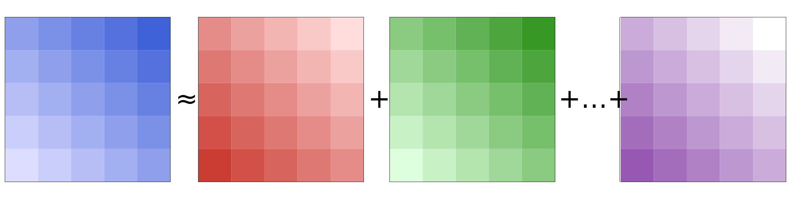

<p align="center"></p>

# MultiResponseVarianceComponentModels
[](http://hua-zhou.github.io/MultiResponseVarianceComponentModels.jl/dev)
[](http://hua-zhou.github.io/MultiResponseVarianceComponentModels.jl/stable)
[](https://github.com/JuliaDiff/BlueStyle)
[](https://github.com/Hua-Zhou/MultiResponseVarianceComponentModels.jl/blob/master/LICENSE)
[](https://github.com/Hua-Zhou/MultiResponseVarianceComponentModels.jl/actions)
[](https://codecov.io/gh/Hua-Zhou/MultiResponseVarianceComponentModels.jl)

MultiResponseVarianceComponentModels.jl is a <a href="https://julialang.org"> Julia </a>package that allows fitting and testing multivariate response variance components linear mixed models of form 

<p align="center"></p>

## Installation
```julia
julia> ]
pkg> add https://github.com/Hua-Zhou/MultiResponseVarianceComponentModels.jl.git
```
## Documentation
[](http://hua-zhou.github.io/MultiResponseVarianceComponentModels.jl/dev)

## Examples
```julia
using MultiResponseVarianceComponentModels, LinearAlgebra, Random

# simulation
begin
    Random.seed!(1234)
    n = 1_000  # number of observations
    d = 4      # number of responses
    p = 10     # number of covariates
    m = 3      # number of variance components
    X = rand(n, p)
    B = rand(p, d) # fixed effects
    V = [zeros(n, n) for _ in 1:m] # kernel matrices
    Σ = [zeros(d, d) for _ in 1:m] # variance components
    Ω = zeros(n * d, n * d) # overall nd-by-nd covariance matrix Ω
    for i in 1:m
        Vi = randn(n, n)
        mul!(V[i], transpose(Vi), Vi)
        Σi = randn(d, d)
        mul!(Σ[i], transpose(Σi), Σi)
        kron_axpy!(Σ[i], V[i], Ω) # Ω = Σ[1]⊗V[1] + ... + Σ[m]⊗V[m]
    end
    Ωchol = cholesky(Ω)
    Y = X * B + reshape(Ωchol.L * randn(n * d), n, d)
end

# maximum likelihood estimation
model = MRVCModel(Y, X, V)
fit!(model)

# residual maximum likelihood estimation
model = MRVCModel(Y, X, V; reml = true)
fit!(model)
```
## References
- <u>H. Zhou, L. Hu, J. Zhou, and K. Lange: **MM algorithms for variance components models** (2019) ([link](https://doi.org/10.1080/10618600.2018.1529601))</u>
- <u>M. Kim: **Gene regulation in the human brain and the biological mechanisms underlying psychiatric disorders** (2022) ([link](https://escholarship.org/uc/item/9v08q5f7))</u>

## See also
- J. Kim, J. Shen, A. Wang, D.V. Mehrotra, S. Ko, J.J. Zhou, and H. Zhou: **VCSEL: Prioritizing SNP-set by penalized variance component selection** (2021) ([link](http://doi.org/10.1214/21-aoas1491))
- L. Hu, W. Lu, J. Zhou, and H. Zhou: **MM algorithms for variance component estimation and selection in logistic linear mixed models** (2019) ([link](http://doi.org/10.5705/ss.202017.0220))
- J.J. Zhou, T. Hu, D. Qiao, M.H. Cho, and H. Zhou: **Boosting gene mapping power and efficiency with efficient exact variance component tests of single nucleotide polymorphism sets** (2016) ([link](http://doi.org/10.1534/genetics.116.190454))